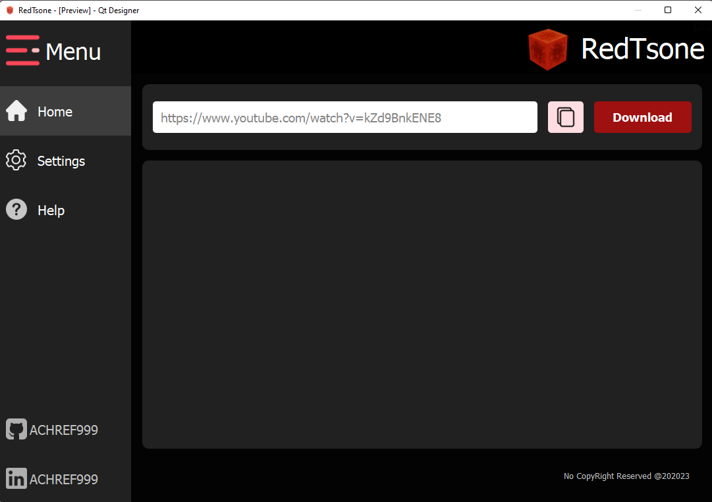

# This is a primitive version of a Utube Downloader  
So far it only supports my needs for today
feel free to tweak it to your personal prefrences

it downloads the videos ( of "720p" res or less ) of a playlist not much of folder structure  or GUI so far 
might add'em when im free


( also there is no handling of parrallel downloads from my side )

` It is what it is `

## To get Started : 

```
> git clone https://github.com/ACHREF999/utubeDownloader.git
```
```
> pip install -r requirements.txt
```

```
> python downloader.py
```

enter your url and it will download


### UI Design

UI looking minimalistic I prioritized dark mode idk if i will add light mode cuz it sounds useless at the moment



